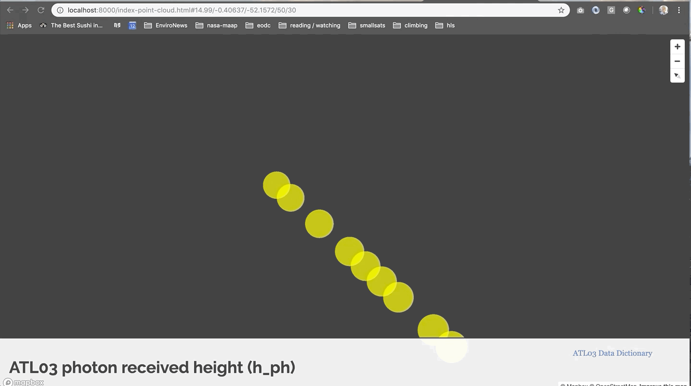

# Icesat-2 Visualization Sandbox

This repo houses exploration into visualizing Icesat-2 products, specifically ATL03 and ATL08.

At the moment it is focused on simulating some 3-D visualization using mapbox tools. Code to generate geojson from hdf files lives in atl-to-geojson.py.

## Works in Progress

* http://jsfiddle.net/aimeeb/b5psv37c/1/ - uses 'fill-extrusion' type and
  artificially generated geojson from points to form a cuboid.
* index-point-cloud.html - Uses deck.gl Point Cloud Layer (deck.gl) to represent geojson points
  * Best representation of 3D points but not sure how it will behave on a global scale. Also simplest to implement (just generate the point geojson).
    * Reasonable to believe that generating geojson for global atl03 will be unmanageable.
* index-extrusion.html
  * Uses [tileserver-gl](https://github.com/maptiler/tileserver-gl) to server
    tiles generated from geojson polygon features
  * generate geojson using `atl-to-geojson.py`, then mbtiles using tippecanoe and then join with original using `tile-join`.
  * Run tileserver and point the mvt layer to the tile server
  * Currently the index is not collection dependent and parameters are working for ATL03 photons.

## References

* [ATL03 Data Dictionary](https://nsidc.org/sites/nsidc.org/files/technical-references/ATL03%20Product%20Data%20Dictionary.pdf)
* [ATL08 Data Dictionary](https://nsidc.org/sites/nsidc.org/files/technical-references/ATL08%20Product%20Data%20Dictionary.pdf)
* [Coloring LIDAR: Build your own 3D map with LIDAR point clouds](https://blog.mapbox.com/coloring-lidar-4522ca5a7186)
* [deck.gl: Point Cloud Layer Documentation](https://github.com/uber/deck.gl/blob/master/docs/layers/point-cloud-layer.md)
* [tippecanoe (geojson to mbtiles)](https://github.com/mapbox/tippecanoe)
* [mbview: library for visualizing mapbox tiles](https://github.com/mapbox/mbview)
* [Decimal degrees](https://en.wikipedia.org/wiki/Decimal_degrees)

## For further researach

* deck.gl
* potree
* cesium
